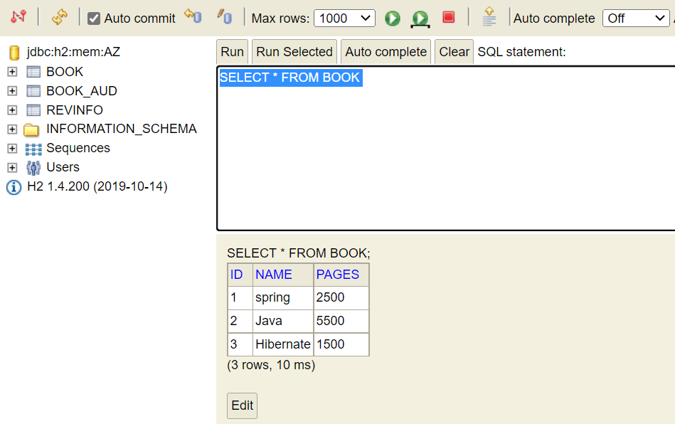
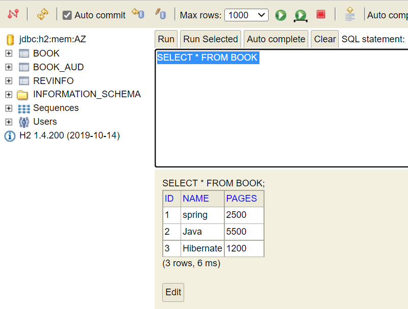
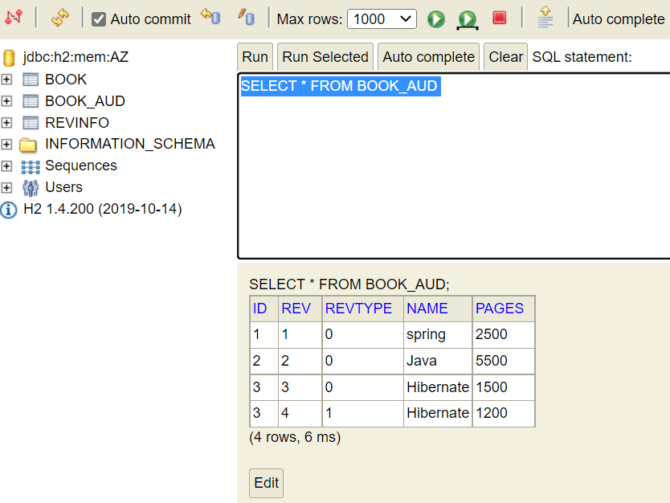
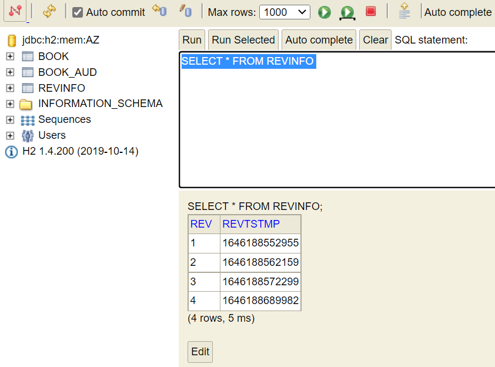

# Spring Boot Auditing

This project demonstrate the use of _**spring-data-envers**_ dependency for auditing purpose.

# Points to remember
- Create Repository interface by extending `RevisionRepository`
- Updated entity class by annotation `@Audited`
- Main class updated with annotation `@EnableJpaRepositories(repositoryFactoryBeanClass = EnversRevisionRepositoryFactoryBean.class)`
- Revision history printed in console

# Details 

3 Books added in database :

updated pages of 3rd book :

Book update details recorded by audit table :

REVTYPE gives the details about previous and current number of pages.

Book updates timestamp details :

