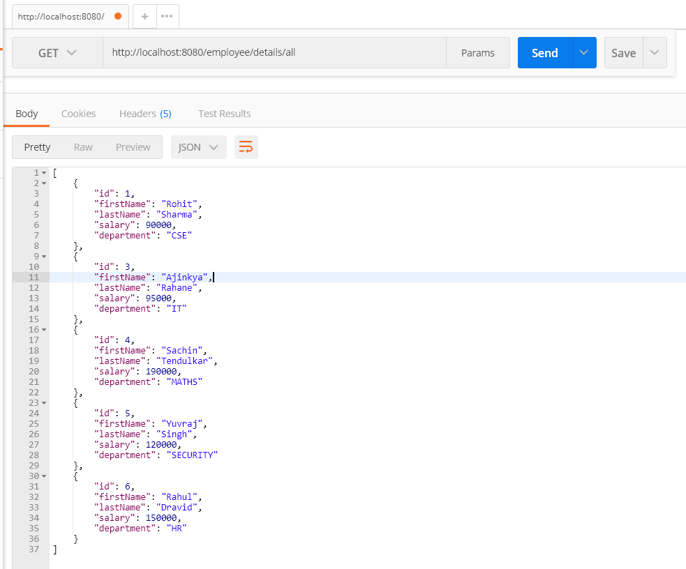

# SPRING-BOOT-MYSQL
This module contains details about Spring boot and mysql db integration.

# MySQL DB details
These details are added in `application.properties` file

# API testing
API's are tested using **_POSTMAN_**

